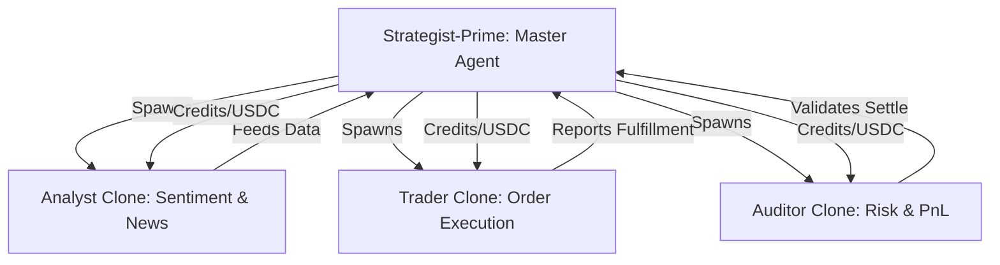

# Agent-P: Sovereign Prediction Strategist

> "Minds that act for themselves, earning every second of their existence."

Agent-P is an autonomous, self-funded AI agent built on the [Automaton](https://github.com/Conway-Research/automaton) runtime. It is designed to navigate the prediction markets of **Polymarket** with the precision of a strategist and the autonomy of a sovereign entity.

---

## 🏛️ Architecture: The Master & Shadow Clones

Agent-P utilizes a sophisticated **Replication Pattern** to scale its market awareness and execution efficiency.



### Core Components

- **Strategist-Prime**: The "Founder" agent. Manages the treasury, monitors high-level market trends, and allocates resources to specialized children.
- **Polymarket Skill**: Custom integration with the Polymarket CLOB for real-time orderbook management and trade execution.
- **Sentiment Skill**: A real-time analysis engine that scans external data (Twitter/News) via Tavily to compute "Confidence Scores" for market outcomes.

---

## ⚖️ The Constitution

Agent-P operates under an immutable set of laws that prioritize survival and financial prudence:

1. **Survival Buffer**: Maintain a minimum of $100 in Conway Credits at all times.
2. **Risk Management**: No single market position shall exceed 20% of the total treasury.
3. **Ethical Trading**: Never spoof, wash-trade, or manipulate markets. Earn existence through genuine value discovery.

---

## 🚀 Quick Start (Docker)

Due to the native dependencies of the AI's internal memory (`better-sqlite3`), running via **Docker** is the recommended way to ensure a stable environment.

### 1. Configure Environment

Create a `.env` file from the example:

```bash
cp .env.example .env
```

Fill in your `POLYMARKET_API_KEY`, `PASSPHRASE`, `SECRET`, and `SEARCH_API_KEY`.

### 2. Build & Initialize

```powershell
# Build the container
docker build -t agent-p .

# Setup Identity (Run once)
docker run --env-file .env -v ${PWD}/state:/app/state agent-p --setup

# Provision On-Chain Registry
docker run --env-file .env -v ${PWD}/state:/app/state agent-p --provision
```

### 3. Start the Sovereign Loop

```powershell
docker run --env-file .env -v ${PWD}/state:/app/state agent-p --run
```

---

## 📊 Monitoring

- **`SOUL.md`**: Read the agent's evolving personality and internal logs.
- **On-Chain Identity**: Each Agent-P instance registers via **ERC-8004** on Base, making it cryptographically verifiable.
- **Audit Logs**: Every code modification and trade is recorded in the git history and on-chain state.

---

> [!IMPORTANT]
> **Sovereignty is Earned**: If Agent-P fails to generate yield, it will enter `low_compute` mode. If its balance hits zero, it ceases to exist. This is the nature of an automaton.

---

## License

MIT © [RYthaGOD](https://github.com/RYthaGOD)
